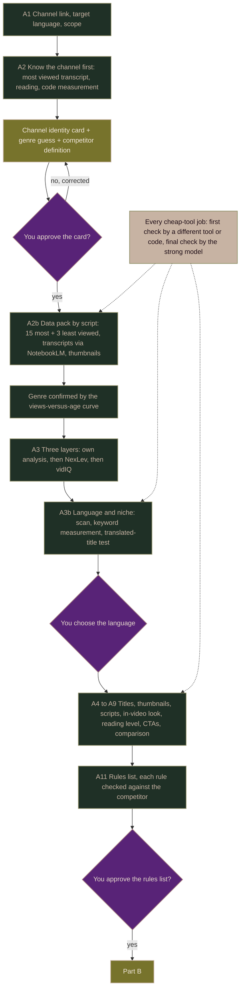
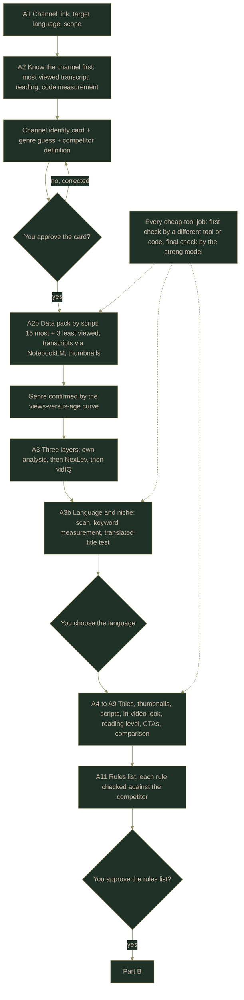
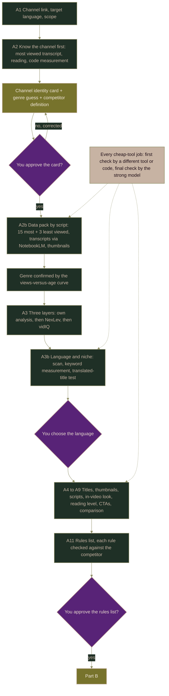

# test

v1 no init

```mermaid
flowchart TD
    A1["A1 Channel link, target language, scope"] --> A2["A2 Know the channel first: most viewed transcript, reading, code measurement"]
    A2 --> CARD["Channel identity card + genre guess + competitor definition"]
    CARD --> G1{"You approve the card?"}
    G1 -- "no, corrected" --> CARD
    G1 -- "yes" --> A2B["A2b Data pack by script: 15 most + 3 least viewed, transcripts via NotebookLM, thumbnails"]
    A2B --> CURVE["Genre confirmed by the views-versus-age curve"]
    CURVE --> A3["A3 Three layers: own analysis, then NexLev, then vidIQ"]
    A3 --> LANG["A3b Language and niche: scan, keyword measurement, translated-title test"]
    LANG --> G2{"You choose the language"}
    G2 --> DEEP["A4 to A9 Titles, thumbnails, scripts, in-video look, reading level, CTAs, comparison"]
    DEEP --> RULES["A11 Rules list, each rule checked against the competitor"]
    RULES --> G3{"You approve the rules list?"}
    G3 -- "yes" --> PART_B["Part B"]
    CHK["Every cheap-tool job: first check by a different tool or code, final check by the strong model"] -.-> A2B
    CHK -.-> LANG
    CHK -.-> DEEP
    classDef base fill:#1F3026,stroke:#8F8E66,color:#C7B3A3,stroke-width:1.5px
    classDef gate fill:#582377,stroke:#A3787B,color:#E6D9CC,stroke-width:1.5px
    classDef tool fill:#C7B3A3,stroke:#8F8E66,color:#1D0C15,stroke-width:1.5px
    classDef out fill:#77732C,stroke:#C7B3A3,color:#F2E8DD,stroke-width:1.5px
    class A1,A2,A2B,CURVE,A3,LANG,DEEP,RULES base
    class G1,G2,G3 gate
    class CARD,PART_B out
    class CHK tool
```

v2 no classDef/class

```mermaid
%%{init: {"theme":"base","themeVariables":{"fontFamily":"Georgia, serif","primaryColor":"#1F3026","primaryTextColor":"#C7B3A3","primaryBorderColor":"#8F8E66","lineColor":"#8F8E66","tertiaryTextColor":"#C7B3A3","edgeLabelBackground":"#1F3026"}}}%%
flowchart TD
    A1["A1 Channel link, target language, scope"] --> A2["A2 Know the channel first: most viewed transcript, reading, code measurement"]
    A2 --> CARD["Channel identity card + genre guess + competitor definition"]
    CARD --> G1{"You approve the card?"}
    G1 -- "no, corrected" --> CARD
    G1 -- "yes" --> A2B["A2b Data pack by script: 15 most + 3 least viewed, transcripts via NotebookLM, thumbnails"]
    A2B --> CURVE["Genre confirmed by the views-versus-age curve"]
    CURVE --> A3["A3 Three layers: own analysis, then NexLev, then vidIQ"]
    A3 --> LANG["A3b Language and niche: scan, keyword measurement, translated-title test"]
    LANG --> G2{"You choose the language"}
    G2 --> DEEP["A4 to A9 Titles, thumbnails, scripts, in-video look, reading level, CTAs, comparison"]
    DEEP --> RULES["A11 Rules list, each rule checked against the competitor"]
    RULES --> G3{"You approve the rules list?"}
    G3 -- "yes" --> PART_B["Part B"]
    CHK["Every cheap-tool job: first check by a different tool or code, final check by the strong model"] -.-> A2B
    CHK -.-> LANG
    CHK -.-> DEEP
```

v3 no dotted CHK edges

```mermaid
%%{init: {"theme":"base","themeVariables":{"fontFamily":"Georgia, serif","primaryColor":"#1F3026","primaryTextColor":"#C7B3A3","primaryBorderColor":"#8F8E66","lineColor":"#8F8E66","tertiaryTextColor":"#C7B3A3","edgeLabelBackground":"#1F3026"}}}%%
flowchart TD
    A1["A1 Channel link, target language, scope"] --> A2["A2 Know the channel first: most viewed transcript, reading, code measurement"]
    A2 --> CARD["Channel identity card + genre guess + competitor definition"]
    CARD --> G1{"You approve the card?"}
    G1 -- "no, corrected" --> CARD
    G1 -- "yes" --> A2B["A2b Data pack by script: 15 most + 3 least viewed, transcripts via NotebookLM, thumbnails"]
    A2B --> CURVE["Genre confirmed by the views-versus-age curve"]
    CURVE --> A3["A3 Three layers: own analysis, then NexLev, then vidIQ"]
    A3 --> LANG["A3b Language and niche: scan, keyword measurement, translated-title test"]
    LANG --> G2{"You choose the language"}
    G2 --> DEEP["A4 to A9 Titles, thumbnails, scripts, in-video look, reading level, CTAs, comparison"]
    DEEP --> RULES["A11 Rules list, each rule checked against the competitor"]
    RULES --> G3{"You approve the rules list?"}
    G3 -- "yes" --> PART_B["Part B"]
    classDef base fill:#1F3026,stroke:#8F8E66,color:#C7B3A3,stroke-width:1.5px
    classDef gate fill:#582377,stroke:#A3787B,color:#E6D9CC,stroke-width:1.5px
    classDef tool fill:#C7B3A3,stroke:#8F8E66,color:#1D0C15,stroke-width:1.5px
    classDef out fill:#77732C,stroke:#C7B3A3,color:#F2E8DD,stroke-width:1.5px
    class A1,A2,A2B,CURVE,A3,LANG,DEEP,RULES base
    class G1,G2,G3 gate
    class CARD,PART_B out
```

v4 original

```mermaid
%%{init: {"theme":"base","themeVariables":{"fontFamily":"Georgia, serif","primaryColor":"#1F3026","primaryTextColor":"#C7B3A3","primaryBorderColor":"#8F8E66","lineColor":"#8F8E66","tertiaryTextColor":"#C7B3A3","edgeLabelBackground":"#1F3026"}}}%%
flowchart TD
    A1["A1 Channel link, target language, scope"] --> A2["A2 Know the channel first: most viewed transcript, reading, code measurement"]
    A2 --> CARD["Channel identity card + genre guess + competitor definition"]
    CARD --> G1{"You approve the card?"}
    G1 -- "no, corrected" --> CARD
    G1 -- "yes" --> A2B["A2b Data pack by script: 15 most + 3 least viewed, transcripts via NotebookLM, thumbnails"]
    A2B --> CURVE["Genre confirmed by the views-versus-age curve"]
    CURVE --> A3["A3 Three layers: own analysis, then NexLev, then vidIQ"]
    A3 --> LANG["A3b Language and niche: scan, keyword measurement, translated-title test"]
    LANG --> G2{"You choose the language"}
    G2 --> DEEP["A4 to A9 Titles, thumbnails, scripts, in-video look, reading level, CTAs, comparison"]
    DEEP --> RULES["A11 Rules list, each rule checked against the competitor"]
    RULES --> G3{"You approve the rules list?"}
    G3 -- "yes" --> PART_B["Part B"]
    CHK["Every cheap-tool job: first check by a different tool or code, final check by the strong model"] -.-> A2B
    CHK -.-> LANG
    CHK -.-> DEEP
    classDef base fill:#1F3026,stroke:#8F8E66,color:#C7B3A3,stroke-width:1.5px
    classDef gate fill:#582377,stroke:#A3787B,color:#E6D9CC,stroke-width:1.5px
    classDef tool fill:#C7B3A3,stroke:#8F8E66,color:#1D0C15,stroke-width:1.5px
    classDef out fill:#77732C,stroke:#C7B3A3,color:#F2E8DD,stroke-width:1.5px
    class A1,A2,A2B,CURVE,A3,LANG,DEEP,RULES base
    class G1,G2,G3 gate
    class CARD,PART_B out
    class CHK tool
```

