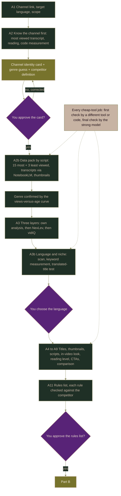
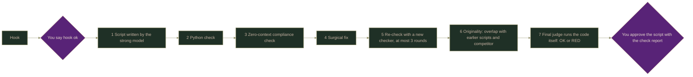

# test2

renamed 0

```mermaid
%%{init: {"theme":"base","themeVariables":{"fontFamily":"Georgia, serif","primaryColor":"#1F3026","primaryTextColor":"#C7B3A3","primaryBorderColor":"#8F8E66","lineColor":"#8F8E66","tertiaryTextColor":"#C7B3A3","edgeLabelBackground":"#1F3026"}}}%%
flowchart TD
    A1["A1 Channel link, target language, scope"] --> A2["A2 Know the channel first: most viewed transcript, reading, code measurement"]
    A2 --> CARD["Channel identity card + genre guess + competitor definition"]
    CARD --> G1{"You approve the card?"}
    G1 -- "no, corrected" --> CARD
    G1 -- "yes" --> A2B["A2b Data pack by script: 15 most + 3 least viewed, transcripts via NotebookLM, thumbnails"]
    A2B --> CURVE["Genre confirmed by the views-versus-age curve"]
    CURVE --> A3["A3 Three layers: own analysis, then NexLev, then vidIQ"]
    A3 --> LANG["A3b Language and niche: scan, keyword measurement, translated-title test"]
    LANG --> G2{"You choose the language"}
    G2 --> DEEP["A4 to A9 Titles, thumbnails, scripts, in-video look, reading level, CTAs, comparison"]
    DEEP --> RULES["A11 Rules list, each rule checked against the competitor"]
    RULES --> G3{"You approve the rules list?"}
    G3 -- "yes" --> PART_B["Part B"]
    CHECK["Every cheap-tool job: first check by a different tool or code, final check by the strong model"] -.-> A2B
    CHECK -.-> LANG
    CHECK -.-> DEEP
    classDef cBase fill:#1F3026,stroke:#8F8E66,color:#C7B3A3,stroke-width:1.5px
    classDef cGate fill:#582377,stroke:#A3787B,color:#E6D9CC,stroke-width:1.5px
    classDef cTool fill:#C7B3A3,stroke:#8F8E66,color:#1D0C15,stroke-width:1.5px
    classDef cOut fill:#77732C,stroke:#C7B3A3,color:#F2E8DD,stroke-width:1.5px
    class A1,A2,A2B,CURVE,A3,LANG,DEEP,RULES cBase
    class G1,G2,G3 cGate
    class CARD,PART_B cOut
    class CHECK cTool
```

renamed 1

```mermaid
%%{init: {"theme":"base","themeVariables":{"fontFamily":"Georgia, serif","primaryColor":"#1F3026","primaryTextColor":"#C7B3A3","primaryBorderColor":"#8F8E66","lineColor":"#8F8E66","tertiaryTextColor":"#C7B3A3","edgeLabelBackground":"#1F3026"}}}%%
flowchart TD
    B1["B1 Rules list and genre approved, language decided"] --> B1B["B1b Topics and competitor videos ranked by Outlier and VPH"]
    B1B --> B1C["B1c Main-concept keyword measurement"]
    B1C --> G4{"You approve the titles?"}
    G4 --> B2["B2 Question form filled from the competitor: measured value, suggestion, your decision"]
    B2 --> G5{"You fill in the form"}
    G5 --> B5["B5 Checker tools generated per channel + rule matrix + self-test"]
    B5 --> B3["B3 Master prompt written by the strong model"]
    B3 --> R["B6 Audit round: Python master check + fresh zero-context checker"]
    R --> FIX["Fix findings"]
    FIX --> R2{"CRITICAL findings left and fewer than 3 rounds?"}
    R2 -- "yes" --> R
    R2 -- "no" --> G6{"You approve the open points"}
    G6 --> M["Master prompt ready"]
    classDef cBase fill:#1F3026,stroke:#8F8E66,color:#C7B3A3,stroke-width:1.5px
    classDef cGate fill:#582377,stroke:#A3787B,color:#E6D9CC,stroke-width:1.5px
    classDef cOut fill:#77732C,stroke:#C7B3A3,color:#F2E8DD,stroke-width:1.5px
    class B1,B1B,B1C,B2,B5,B3,R,FIX cBase
    class G4,G5,R2,G6 cGate
    class M cOut
```

renamed 2

```mermaid
%%{init: {"theme":"base","themeVariables":{"fontFamily":"Georgia, serif","primaryColor":"#1F3026","primaryTextColor":"#C7B3A3","primaryBorderColor":"#8F8E66","lineColor":"#8F8E66","tertiaryTextColor":"#C7B3A3","edgeLabelBackground":"#1F3026"}}}%%
flowchart LR
    H["Hook"] --> HK{"You say hook ok"}
    HK --> W["1 Script written by the strong model"]
    W --> C1["2 Python check"]
    C1 --> C2["3 Zero-context compliance check"]
    C2 --> F["4 Surgical fix"]
    F --> C3["5 Re-check with a new checker, at most 3 rounds"]
    C3 --> O["6 Originality: overlap with earlier scripts and competitor"]
    O --> J["7 Final judge runs the code itself: OK or RED"]
    J --> U{"You approve the script with the check report"}
    classDef cBase fill:#1F3026,stroke:#8F8E66,color:#C7B3A3,stroke-width:1.5px
    classDef cGate fill:#582377,stroke:#A3787B,color:#E6D9CC,stroke-width:1.5px
    class H,W,C1,C2,F,C3,O,J cBase
    class HK,U cGate
```

